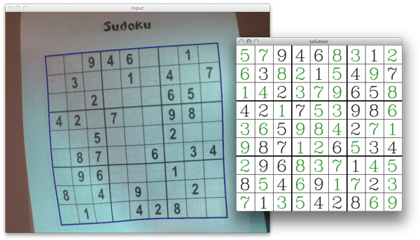

<div align="center"></div>

Solve sudokus by showing them to your webcam.

This program is written in Python and uses OpenCV for image processing and Tesseract for OCR. The sudoku is solved using the python-constraint library.


## Screenshots
<div align="center"></div>


## Download
Coming soon.

- Mac OS X
- Windows


## Running from source
To run the program execute (To close the program press `q`):
```
python sudoku-cv.py
```
This will start the program in video stream mode with the internal camera.

The script supports several command line arguments:
```
>> python sudoku-cv.py --help
usage: sudoku-cv.py [-h] [-o FILE] [-c CAMERA] [-d]

optional arguments:
  -h, --help            show this help message and exit
  -o FILE, --file FILE  Input file (eg: test.png)
  -c CAMERA, --camera CAMERA
                        Camera stream to capture, default: 0
  -d, --debug           Enable debug mode (shows processing steps)
```

- To open a test picture use:
`python sudoku-cv.py -o test_pictures/sudoku-easy.png`
- To use another connected camera than the internal one (default: 0):
`python sudoku-cv.py -c 1`


## Installing the development environment
This program is tested with `Python 2.7.5`, `OpenCV 2.4.7`,
`tesseract 3.02.02`, `numpy 1.8.0` and `python-tesseract 2.0.11` but should work with newer versions.

On Windows:

- Install [Python(x,y)](https://code.google.com/p/pythonxy/wiki/Downloads)
- Install [Tesseract](https://code.google.com/p/tesseract-ocr)
- `pip install python-tesseract` in command line
- start program with `python sudoku-cv.py`

On Mac:

- Install [Homebrew](http://brew.sh)
- `brew install python opencv tesseract`
- `pip install python-tesseract`
- start program with `python sudoku-cv.py`


## Creating standalone executables
First make sure you can run the program successfully with `python sudoku-cv.py`. Then compile the files using [PyInstaller](https://github.com/pyinstaller/pyinstaller)

```
Mac:
python -O pyinstaller.py sudoku-cv-mac.spec

Windows:
python -O pyinstaller.py sudoku-cv.py
```

## Documentation
You can find .tex files for the German step-by-step documentation for the code in the folder `Documentation`.
Please open an issue in this repository if you have any questions.
